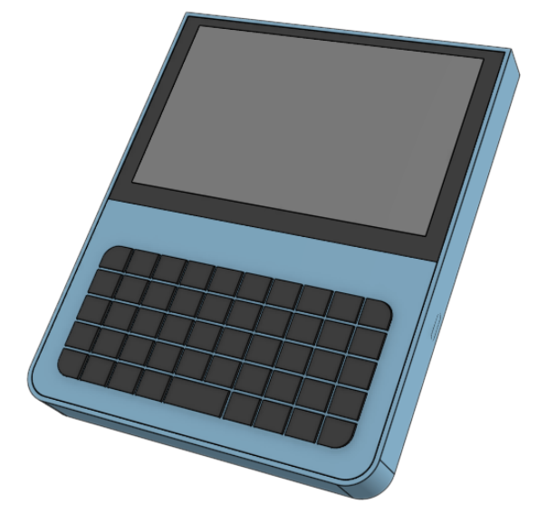

# Decktility

A custom-built cyberdeck, inspired by various handheld PCs and palmtops, but especially by [Yarh.io Micro 2](https://yarh.io/).

This project is a work in progress.

# Features

- Dimensions: 124.4 mm width, 150.0 mm height, 16.1mm depth
- Powered by a Raspberry Pi CM4 and a BTT Pad 5 (800x480 resolution with capacitive touch)
- Compact design
- Replaceable batteries
- About 20 hours of battery life (\*)
- USB-C charging
- Power management (reports to the Pi and refuses to turn on when battery is critically low)

(\*) Using US18650VTC6 cells. Power draw was tested with an idle Discord tab in Chrome.

# Software

## Raspberry Pi

The Pi can be given the OS of your chosing. Consider [Raspberry Pi OS](https://www.raspberrypi.com/software/) or [Kali](https://www.kali.org/docs/arm/raspberry-pi-4/).

Check the to the [Pad 5 Manual](https://github.com/bigtreetech/Raspberry-Pad/tree/master/Pad5) for installing the OS and setting up some of the hardware.

The [Power Manager Client](./powermanager-client) is used to communicate charging status and battery status to the Arduino Nano. This info can be used to show warnings or even auto-shutdown the Pi.

## Arduino Nano / Power Manager

The [Power Manager](./powermanager) controls the power connection to the Pi and the keyboard. Power is enabled/disabled depending on the battery voltage.

The power manager measures battery and charging status, and can send it over I2C to the Pi.

The project can be opened and built with Arduino IDE v2 from [Arduino.cc](https://www.arduino.cc/).

# Case

The case is available as open hardware via [OnShape](https://cad.onshape.com/documents/bcf3b5212bb2ba6496cfe6cf/w/d70be68a60b4c80f684ba746/e/f2fb47dfa2dbdc91d7666ed1).

# Bill of materials

The links are mainly to search results, as links to specific items tend to fail as shops update their stock.
Make sure to double-check that you're ordering the correct item.

- BigTreeTech Pad 5
- Raspberry Pi CM4 (the model of your choice)
- Arduino Nano (or clone)
- Electronic Switch Control Board (e.g. F5305S PMOS Trigger Module on [AliExpress](https://www.aliexpress.com/w/wholesale-F5305S-PMOS-Trigger-Module.html?catId=0&SearchText=F5305S+PMOS+Trigger+Module))
- 5V 3A step down converter ([AliExpress](https://www.aliexpress.com/w/wholesale-3A-Mini-Step-Down-Converter-Board.html?catId=0&SearchText=3A+Mini+Step+Down+Converter+Board))
- USB C 2S battery charger/BMS ([AliExpress](https://www.aliexpress.com/w/wholesale-Type%2525252dC-USB-2%252F3S-BMS-15W.html?catId=0&origin=y&SearchText=Type-C+USB+2%2F3S+BMS+15W+))
- BlueTooth mini keyboard with 49 keys ([AliExpress](https://www.aliexpress.com/w/wholesale-bluetooth-mini-keyboard-49-keys.html?catId=0&SearchText=bluetooth+mini+keyboard+49+keys))
- 2x 18650 battery (`1.5 A` charge current, e.g. `US18650VTC6`)
- 2x 18650 SMT battery holder ([AliExpress](https://www.aliexpress.com/w/wholesale-18650-battery-holder-smt.html?catId=0&SearchText=18650+battery+holder+smt))

# License

All hardware, software and other content in this project are licensed under `Attribution-ShareAlike 4.0 International (CC BY-SA 4.0)`.

See [LICENSE.md](LICENSE.md) for details. For a short overview and translations go to the [Creative Commons website](https://creativecommons.org/licenses/by-sa/4.0/legalcode).

