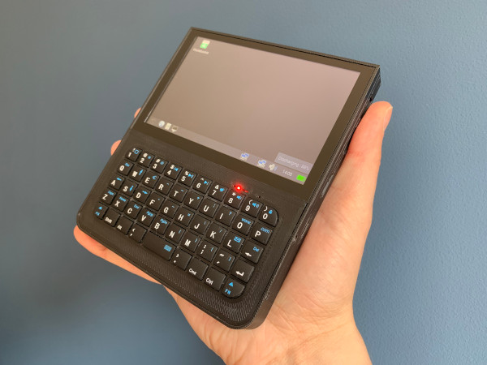
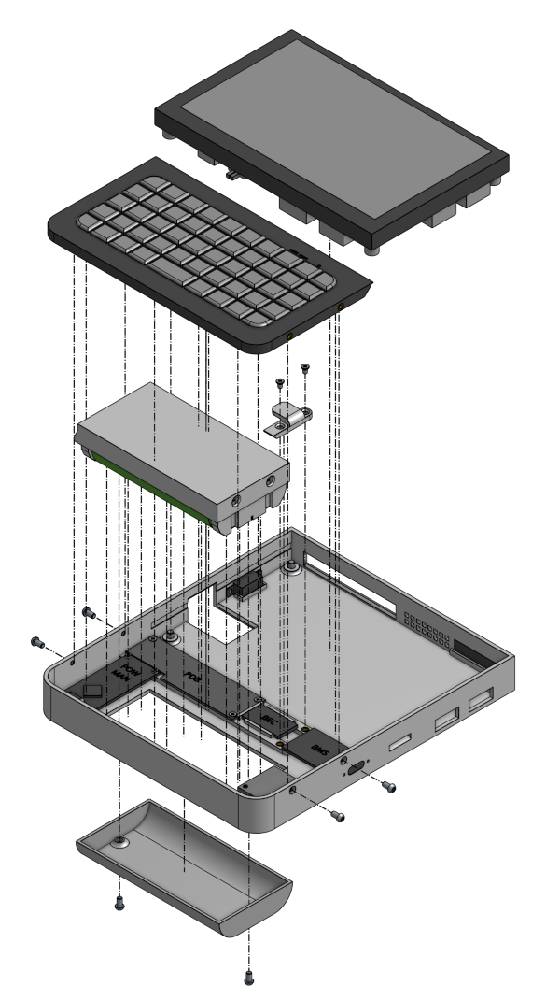

# Decktility

Decktility is a handheld PC, inspired by [Yarh.io Micro 2](https://yarh.io/),
[uConsole](https://www.clockworkpi.com/uconsole) and various retro handheld PCs.

It is built with a Raspbery Pi CM4 and an 800x480 pixel IPS screen with capacitive touch.
A set of batteries offers about 6 hours of battery life.

# Features & Specifications

- Compact design: `124.4 x 144.0 x 16.3 mm` (w x h x d). The battery lid portrudes by `10.2 mm`.
- Weighs approximately `375 g`. (depends on filament weight)
- Powered by a Raspberry Pi CM4 and a BTT Pad 5 (`800x480` resolution with capacitive touch)
- Replaceable batteries, for when `6 h` of battery life isn't enough. (\*)
- USB-C charging (~`10 W`)
- Power management

(\*) Using US18650VTC6 cells. Power draw was tested with an idle Discord tab in Chrome.

# Software

## Raspberry Pi

The Pi can be used with [Raspberry Pi OS](https://www.raspberrypi.com/software/) or any other Pi-compatible OS.

Check the to the [Pad 5 Manual](https://github.com/bigtreetech/Raspberry-Pad/tree/master/Pad5) for installing the OS and setting up some of the hardware.

## Arduino Nano / Power Manager

The [Power Manager](./powermanager) controls the power connection to the Pi and the keyboard. Power is enabled/disabled depending on the battery voltage.
The power manager measures battery and charging status, and can send it to the Pi. This enables battery status on the Pi desktop.
If something is not clear - or if you find an error, please open an issue on the GitHub project page.

Check out the [assembly guide](docs/assembling.md) for more details.

# Case

The latest printable parts are in the [printables](printables) folder.

The case is available as open hardware via OnShape:
- [v1.1](https://cad.onshape.com/documents/bcf3b5212bb2ba6496cfe6cf/v/382999b629ab56cddd2b7e21/e/5dfdd5987e1df112fcfa814b)
- [Main/WIP](https://cad.onshape.com/documents/bcf3b5212bb2ba6496cfe6cf/w/d70be68a60b4c80f684ba746/e/f2fb47dfa2dbdc91d7666ed1)

**Warning**: Don't print from the Main branch, because it will possibly have unfinished and/or untested changes.

# Building

Build this project at [your own risk](LICENSE.md).
The build guide might have flaws.
Working with batteries and electronics is not without risk.

- [Bill of materials](docs/bom.md)
- [Printing guide](docs/printing.md)
- [Assembling](docs/assembling.md)

# License

All hardware, software and other content in this project are licensed under `Attribution-ShareAlike 4.0 International (CC BY-SA 4.0)`.

See [LICENSE.md](LICENSE.md) for details. For a short overview and translations go to the [Creative Commons website](https://creativecommons.org/licenses/by-sa/4.0/legalcode).

