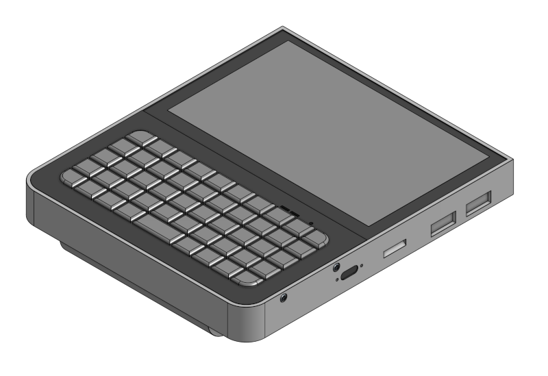

# Decktility

Decktility is a handheld PC, inspired by by [Yarh.io Micro 2](https://yarh.io/) and [uConsole](https://www.clockworkpi.com/uconsole).

It is built with a Raspbery Pi CM4 and BigTreeTech Pad 5, resulting in a relatively compact and lightweight device with about 20 hours of battery life.

# Project status

This project is in **beta**. Things that need fixing:

- Panel gap between screen and keyboard
- No I2C yet due to mosfet setup
- Fan touches outlet (noisy): the fan currently touches the air outlet part. It needs a recess. The temporary fix is to cut out the outlet shape so it becomes an open hole.
- GPIO alignment issue
- Document I2C tools from https://learn.adafruit.com/scanning-i2c-addresses/raspberry-pi

# Features

- Compact design: `124.4 x 144.0 x 16.3 mm` (w x h x d). The battery lid portrudes by `10.2 mm`.
- Relatively light weight at approximately `300 g`. (depends on filament weight)
- Powered by a Raspberry Pi CM4 and a BTT Pad 5 (`800x480` resolution with capacitive touch)
- Replaceable batteries, for when `20 h` of battery life isn't enough. (\*)
- USB-C charging
- Power management (reports to the Pi and refuses to turn on when battery is critically low)

(\*) Using US18650VTC6 cells. Power draw was tested with an idle Discord tab in Chrome.

# Software

## Raspberry Pi

The Pi can be given the OS of your chosing. Consider [Raspberry Pi OS](https://www.raspberrypi.com/software/) or [Kali](https://www.kali.org/docs/arm/raspberry-pi-4/).

Check the to the [Pad 5 Manual](https://github.com/bigtreetech/Raspberry-Pad/tree/master/Pad5) for installing the OS and setting up some of the hardware.

The [Power Manager Client](./powermanager-client) is used to communicate charging status and battery status to the Arduino Nano. This info can be used to show warnings or even auto-shutdown the Pi.

## Arduino Nano / Power Manager

The [Power Manager](./powermanager) controls the power connection to the Pi and the keyboard. Power is enabled/disabled depending on the battery voltage.

The power manager measures battery and charging status, and can send it over I2C to the Pi.

The project can be opened and built with Arduino IDE v2 from [Arduino.cc](https://www.arduino.cc/).

# Case

The case is available as open hardware via [OnShape](https://cad.onshape.com/documents/bcf3b5212bb2ba6496cfe6cf/w/d70be68a60b4c80f684ba746/e/f2fb47dfa2dbdc91d7666ed1).

# Bill of materials

The links are mainly to search results, as links to specific items tend to fail as shops update their stock.
Make sure to double-check that you're ordering the correct item.

- BigTreeTech Pad 5
- Raspberry Pi CM4
- Arduino Nano V3.0 with USB-C connector
- Electronic Switch Control Board (e.g. FLR784 mosfet module on [AliExpress](https://www.aliexpress.com/w/wholesale-LR784-mosfet-module.html?catId=0&SearchText=LR784+mosfet+module) - note: this will be changed in the future)
- `5 V` `3 A` step down converter, adjustable ([AliExpress](https://www.aliexpress.com/w/wholesale-5v-3a-step-down-12%2525252d20v.html?catId=0&SearchText=5v+3a+step+down+12-20v))
- USB-C 2S battery charger/BMS ([AliExpress](https://www.aliexpress.com/w/wholesale-Type%2525252dC-USB-2%252F3S-BMS-15W.html?catId=0&origin=y&SearchText=Type-C+USB+2%2F3S+BMS+15W+))
- BlueTooth mini keyboard with 49 keys ([AliExpress](https://www.aliexpress.com/w/wholesale-bluetooth-mini-keyboard-49-keys.html?catId=0&SearchText=bluetooth+mini+keyboard+49+keys))
- 2x 18650 battery (`1.5 A` charge current, e.g. `US18650VTC6`)
- 4x Spring steel 18650 leaf spring battery contact
- 11x M2 insert nut (`3 mm` high, `3.5 mm` wide)
- 10x M1.4 3mm button head screw
- 4x M2.5 4 or 5mm (button or flat head) for Pad 5 mounting
- A set of watch maker screws of various sizes (M1.0, M1.2, M1.4)
- ?x M2 screws of various sizes (TBD)
- 2006 5V fan (`20 x 6 mm`)
- Other things like wire, soldering gear, 3D printer.
- Electrical wire: 24 AWG for power and 28 AWG for silicon. (silicon, not plastic)
- SS12F15 mini slide switch
- (optional) Elastic jewelry wire, 1mm, transparent

# Printing Guidelines

The settings below are based on what I used in SuperSlicer (~PrusaSlicer).
They might (not) translate to other slicer software.

## Filament

If your 3D printer does not have an enclosure, use PETG or PCTG.
I prefer using ASA (with ABS/ABS+ as alternative).

Avoid using PLA or other similar low-temperature filaments:
The BMS can get hot (`45 C`, measured outside the case).
There is active cooling, but if the fan is defect, it might heat up the plastic and warp it.

## Printing

Some parts are exported from CAD upside-down and need to be flipped `180 degrees`.

You can print with layer height of `0.2 mm` or finer and a `0.4 mm` nozzle.

### PCB Bracket

Print in normal orientation with build plate supports.

### Battery Cover

Rotate it 90 degrees over the Y axis so it stands up on its side.
You need supports along the edge on this inside.
I painted them on manually, because they get attached to the inner wall.
Alternatively, you can use `Supports: Everywhere`.

Make sure you clean up the inside thoroughly, so it fits on the case.

### Main Case

Note that the walls are relatively thin and weaken the case near connector holes.
This means that your wall adhesion has to be good. Ensure you're running your filament at a high enough
temperature for the speed you're printing at. If you calibrated your filament to work at a minimum
tempearture, you might have to raise it to create sufficient strength.

Consider changing the the top layer fill patern to `Concentric`. This will give you smoother top surface quality,
both for mounting components and for the top edge of the case.

When printing the main case with ASA, I slice with manually added supports only. I place these supports at:
- The counterbores on the back (the ones for mounting the display)
- The ethernet bridging part
- The Pi's IO connector on the back

When printing with ASA, disable bridging fan speed to avoid adhesion problems near the connector openings.
Otherwise, layers might split off when placing the display into the case.

# License

All hardware, software and other content in this project are licensed under `Attribution-ShareAlike 4.0 International (CC BY-SA 4.0)`.

See [LICENSE.md](LICENSE.md) for details. For a short overview and translations go to the [Creative Commons website](https://creativecommons.org/licenses/by-sa/4.0/legalcode).

