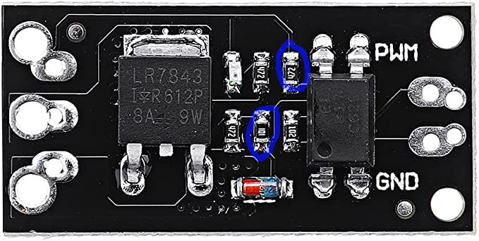

# Assembling Decktility

## Keyboard mod

The keyboard comes with a Lithium battery installed, but I needed it to work with `5 V`.
I copied the idea from [Yarh.io](https://yarh.io/yarh-io-m2.html), but I'll elaborate on it here.

- Desolder the lipo.
- Desolder the USB connector. I ended up cutting it off entirely, including the PCB part under it that sticks out.
- Connect the `5 V` pad from the USB connector to the `+` connector where the lipo was. You can use the pad of the USB connector, but I found it easier to solder directly to the top of `R20`.
- Desolder and remove `U6`. The 2 pads on the bottom right should be soldered together.

## Mosfet module mod

If you are not trying the (untested) alternative [mosfet module](mosfet-alternative.jpg) then you must double up on the `100 R` and `4.7 kR` resistors.
I soldered them on top of the existing ones as encircled in blue:

## Heat inserts

Insert heat inserts:

- In the case
- To the sides of the keyboard top panel
- On the top of the battery container 
