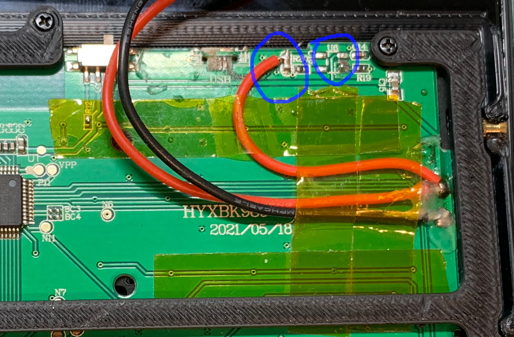

# Assembling Decktility

**Note:** This document is a work in progress.

## Power Manager / Arduino Nano

### Firmware 

You can build the project with `Arduino IDE V2`. Change `config.h` to your liking.

The default (and only) battery and discharge profile is for a Murata VT6 3120 mAh cell.
You can leave it in place, but you can also make your own. It is set in `powermanager.ino`
and the default profile is in `battery.cpp`.

### Pinout

The default pins on the Arduino are as follows:
- `Vbat` is measured at pin `A0`.
- Charge state is measured at pin `D2`. It connects to the LED connector on the USB-C BMS board. This is marked as `LED` on the back or `D` on the front of the PCB.
- The power enable pin for the mosfet is wired to `D3`.
- `Vin` and `Gnd` are wired to the common ground and to the switch that connects to the `5 V` of the step down converter.
- `A4` is `SDA` and `A5` is `SDL`. They connect to the Pi on pin 3 (`SDA`) and pin 5 (`SDL`). SDA to SDA, and SDL to SDL.

If you use an alternative I2C bus on the Pi, the driver won't scan that bus and it won't work.

### Calibrating the voltage

Update the value for `VBAT_ADC_MAX_BATTERY_PIN_VOLTAGE` depending on the resistors you chose.
I used `2.2M` and `3.9M` Ohm. You want to use high resistance values to reduce the current that flows/leaks to the Arduino.
You also want to pick the values in such a way that you don't over-volt the Arduino pin.

I calibrate it as follows:
- Upload firmare with `BATTERY_STATE_LOG` enabled in `config.h`
- Disconnect USB from Arduino
- Measure battery voltage with multimeter
- Reconnect USB to Arduino and observe the voltage readout.
- Check the difference relative to what you expect, and use that factor to multiply or divide with `VBAT_ADC_MAX_BATTERY_PIN_VOLTAGE`
- Repeat the procedure to verify

### Raspberry Pi

Add to the following to `/boot/config.txt`:

```
dtoverlay=ltc294x,ltc2942,resistor-sense=50,prescaler-exponent=128
```

### Debugging I2C

Manually activate the driver:

```bash
modprobe ltc2941-battery-gauge && lsmod | grep ltc
```

Manually deactiate the driver:

```bash
rmmod ltc2941-battery-gauge
```

Check driver status messages:

```bash
dmesg
```

Retrieve the battery status on the Pi with [ic2test.sh](../scripts/i2ctest.sh).

Kernel driver reference: https://github.com/torvalds/linux/blob/master/drivers/power/supply/ltc2941-battery-gauge.c

Implementation reference: https://github.com/MacroYau/LTC2942-Arduino-Library

Datasheet: https://www.analog.com/media/en/technical-documentation/data-sheets/ltc2941.pdf

## Keyboard mod

The keyboard comes with a Lithium battery installed, but I needed it to work with `5 V`.
I copied the idea from [Yarh.io](https://yarh.io/yarh-io-m2.html), but I'll elaborate on it here.

- Desolder the lipo.
- Desolder the USB connector. I ended up cutting it off entirely, including the PCB part under it that sticks out.
- Connect the `5 V` pad from the USB connector to the `+` connector where the lipo was. You can use the pad of the USB connector, but I found it easier to solder directly to the top of `R20`.
- Desolder and remove `U6`. The 2 pads on the bottom right should be soldered together.



## FET module

Build it according to the [schematic](pics/fet-schematic.png) and [PCB placement](pics/fet-pcb.png).

## Heat inserts

Insert heat inserts:

- In the case
- To the sides of the keyboard top panel
- On the top of the battery container 

